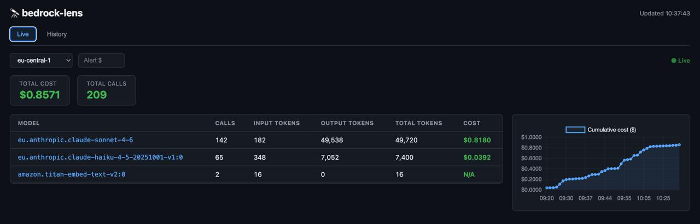
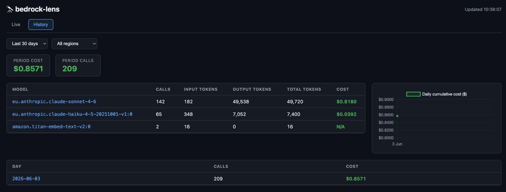

# bedrock-lens-ui

A real-time web dashboard for AWS Bedrock token usage and cost monitoring. Reads directly from CloudWatch model invocation logs, persists history to a local SQLite database, and streams live updates to the browser via SSE.

Inspired by [bedrock-lens](https://github.com/OmarCodes022/bedrock-lens) CLI — no library dependency required.

## Screenshots

**Live tab** — today's usage, auto-refreshing every 5s



**History tab** — aggregated per-model breakdown with region filter


## Features

- **Live tab** — auto-streams today's usage, refreshes every 5s via SSE, no manual refresh needed
- **History tab** — aggregated per-model breakdown, filterable by region, date range (7/30/90 days), and tag
- **Allocation tab** — doughnut pie chart + table breaking spend by tag namespace: type / task / project
- **Tagging system** — auto-tags every invocation at ingest time:
  - `type:telegram` / `type:cron` / `type:subagent` / `type:internal`
  - `task:morning-brief`, `task:email-monitor`, `task:blog-post`, `task:media-monitor`, …
  - `project:bedrock-lens-ui`, `project:nala`, `project:blog`, `project:trains`, …
- **SQLite persistence** — all events saved locally; survives CloudWatch log expiry
- **Daily cost chart** — cumulative cost over time (Chart.js)
- **Spend threshold alert** — in-page warning when daily cost crosses a set amount
- **tinyauth-ready** — designed to run behind a reverse proxy with forward auth

---

## AWS Setup

### 1. Enable Bedrock model invocation logging

Bedrock doesn't log invocations by default. Run this once per AWS account/region:

```bash
# Create the CloudWatch log group
aws logs create-log-group \
  --log-group-name /aws/bedrock/model-invocations \
  --region eu-central-1

# Create IAM role for Bedrock to write logs
aws iam create-role \
  --role-name AmazonBedrockInvocationLoggingRole \
  --assume-role-policy-document '{
    "Version": "2012-10-17",
    "Statement": [{
      "Effect": "Allow",
      "Principal": { "Service": "bedrock.amazonaws.com" },
      "Action": "sts:AssumeRole"
    }]
  }'

aws iam put-role-policy \
  --role-name AmazonBedrockInvocationLoggingRole \
  --policy-name CloudWatchLogsWrite \
  --policy-document '{
    "Version": "2012-10-17",
    "Statement": [{
      "Effect": "Allow",
      "Action": [
        "logs:CreateLogStream",
        "logs:PutLogEvents"
      ],
      "Resource": "arn:aws:logs:eu-central-1:YOUR_ACCOUNT_ID:log-group:/aws/bedrock/model-invocations:*"
    }]
  }'

# Enable logging on the Bedrock service
ROLE_ARN=$(aws iam get-role --role-name AmazonBedrockInvocationLoggingRole \
  --query 'Role.Arn' --output text)

aws bedrock put-model-invocation-logging-configuration \
  --logging-config '{
    "cloudWatchConfig": {
      "logGroupName": "/aws/bedrock/model-invocations",
      "roleArn": "'"$ROLE_ARN"'",
      "largeDataDeliveryS3Config": { "bucketName": "" }
    },
    "textDataDeliveryEnabled": true
  }' \
  --region eu-central-1
```

> Replace `eu-central-1` and `YOUR_ACCOUNT_ID` as needed.  
> The easiest alternative is using [bedrock-lens --setup](https://github.com/OmarCodes022/bedrock-lens) which automates all of the above.

### 2. Set log retention (recommended)

CloudWatch logs are stored forever by default. Set a retention policy to control costs:

```bash
aws logs put-retention-policy \
  --log-group-name /aws/bedrock/model-invocations \
  --retention-in-days 7 \
  --region eu-central-1
```

Minimum supported value is **1 day**. Recommended: **7 days** — the UI persists history locally in SQLite so you won't lose data.

### 3. Grant read permissions to the IAM user running the UI

```bash
aws iam put-user-policy \
  --user-name YOUR_IAM_USER \
  --policy-name bedrock-lens-reader \
  --policy-document '{
    "Version": "2012-10-17",
    "Statement": [{
      "Effect": "Allow",
      "Action": [
        "logs:FilterLogEvents",
        "logs:DescribeLogGroups",
        "logs:DescribeLogStreams"
      ],
      "Resource": "arn:aws:logs:eu-central-1:YOUR_ACCOUNT_ID:log-group:/aws/bedrock/model-invocations:*"
    }]
  }'
```

---

## Running

### Local (dev)

```bash
pip install -r requirements.txt
export AWS_DEFAULT_REGION=eu-central-1
uvicorn app.main:app --reload
# → http://localhost:8000
```

### Docker

```bash
docker build -t bedrock-lens-ui .
docker run -d \
  --name bedrock-lens-ui \
  --restart unless-stopped \
  -p 8765:8000 \
  -v bedrock-lens-data:/data \
  -e AWS_ACCESS_KEY_ID=your_key \
  -e AWS_SECRET_ACCESS_KEY=your_secret \
  -e AWS_DEFAULT_REGION=eu-central-1 \
  -e DB_PATH=/data/history.db \
  -e TZ=Europe/London \
  bedrock-lens-ui
```

Or with `docker compose`:

```bash
# Set env vars first, then:
docker compose up -d
```

### Reverse proxy (Caddy + tinyauth example)

```caddyfile
bedrock.example.com {
    import tls_route53
    import tinyauth
    reverse_proxy 192.168.0.201:8765
}
```

---

## Project structure

```
app/
  main.py              ← FastAPI backend — CloudWatch reader, SQLite, SSE
  templates/
    index.html         ← Single-page UI
  static/
    css/main.css       ← GitHub dark theme
    js/main.js         ← Live table, Chart.js, SSE client
Dockerfile
docker-compose.yml
requirements.txt
```

## Stack

- **FastAPI** + **sse-starlette** — backend + live streaming
- **Jinja2** — server-rendered HTML
- **Chart.js** — line + doughnut charts
- **SQLite** — local history + tagging persistence
- **boto3** — CloudWatch logs reader
- **Docker** — single container deployment

## Tagging

Every Bedrock invocation is auto-tagged at ingest time by inspecting the CloudWatch `inputBodyJson`:

| Tag | Meaning |
|---|---|
| `type:telegram` | Direct conversation / main session |
| `type:cron` | Scheduled cron job |
| `type:subagent` | Spawned sub-agent task |
| `type:internal` | Embedding / internal tooling calls |
| `task:morning-brief` | Morning briefing cron |
| `task:email-monitor` | Email monitor cron |
| `task:blog-post` | Daily blog post cron |
| `task:media-monitor` | Media stack monitor cron |
| `project:*` | Project-level grouping (blog, nala, trains, …) |

The **Allocation tab** lets you pivot spend by `type`, `task`, or `project` with a doughnut pie chart and drilldown table. The **History tab** tag filter lets you scope model breakdowns to a single tag.
